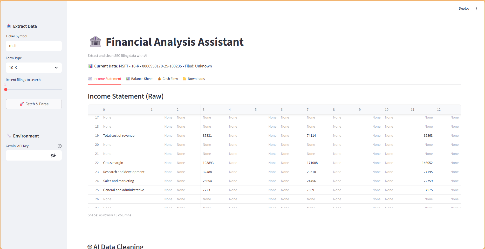
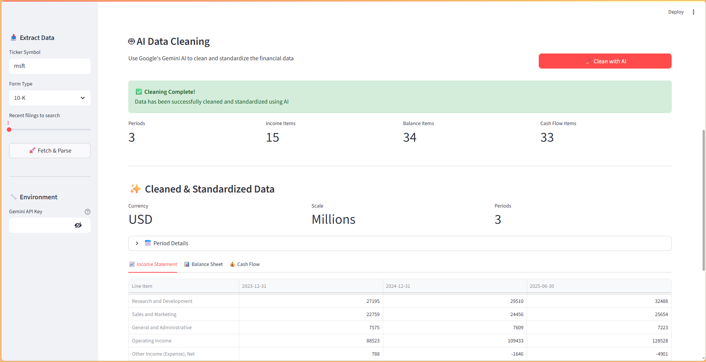

# Financial Analysis Assistant

An open-source Streamlit application that leverages AI and public data to automate financial analysis for any US publicly traded company.  
**Input a company ticker, get SEC filings extraction, AI-powered data cleaning, and standardized financial statements—all in one place!**

[](https://streamlit.io/)
[](https://python.org/)
[](https://ai.google.dev/)
[](https://pydantic.dev/)

---

## 🚀 Features

- **Intelligent Data Extraction:** Custom NLP parsers extract financial tables from SEC EDGAR HTML filings
- **AI-Powered Data Cleaning:** Google Gemini LLM standardizes messy financial data into canonical schema
- **Hybrid Architecture:** Combines traditional NLP extraction with modern LLM cleaning for optimal efficiency
- **Real-time Processing:** Fetches and processes the latest 10-K/10-Q filings on-demand
- **Standardized Output:** Converts company-specific line items to canonical financial statement format
- **Interactive UI:** Clean Streamlit interface with data quality indicators and export options

---

## 🛠️ Tech Stack

- **Python** (pandas, BeautifulSoup, requests)
- **Streamlit** (interactive web interface)
- **SEC EDGAR API** (official filing data)
- **Google Gemini AI** (LLM-powered data cleaning)
- **Pydantic** (data validation and schema enforcement)
- **NLP Libraries** (custom table parsing and extraction)

---

## ✅ Current Progress

### Core Functionality ✨
- [x] **SEC Filing Extraction:** Automatically fetch and parse HTML filings from EDGAR database
- [x] **Financial Table Parsing:** Extract Income Statement, Balance Sheet, and Cash Flow tables using custom NLP
- [x] **AI-Powered Data Cleaning:** Gemini LLM standardizes messy data with engineered prompts
- [x] **Canonical Schema:** Consistent data structure across all companies and filings
- [x] **Data Validation:** Pydantic models ensure data integrity and type safety
- [x] **Error Handling:** Robust fallback systems for edge cases and LLM failures

### User Interface 🎨
- [x] **Interactive Streamlit App:** Professional UI with sidebar controls and tabbed data display
- [x] **Real-time Processing:** Live fetching and cleaning with progress indicators
- [x] **Data Quality Metrics:** Visual indicators showing extraction completeness
- [x] **Export Functionality:** Download raw and cleaned data in CSV/ZIP format
- [x] **API Key Management:** Secure Gemini API key input with validation

### Data Processing 🔧
- [x] **Scale Detection:** Automatic identification of thousands/millions/billions scale
- [x] **Line Item Mapping:** Convert company-specific names to standardized canonical names
- [x] **Period Standardization:** Consistent date formatting and fiscal period identification
- [x] **Numeric Cleaning:** Handle parentheses (negatives), dashes (nulls), and formatting
- [x] **Multi-company Support:** Works with any US publicly traded company

---

## 🔮 Future Roadmap

### Analytics & Insights 📊
- [ ] **Financial Ratio Calculation:** Automate profitability, liquidity, and leverage ratio calculations
- [ ] **Trend Analysis:** Historical data tracking and growth rate calculations
- [ ] **Peer Comparison:** Side-by-side analysis of industry competitors
- [ ] **Key Metrics Dashboard:** Interactive visualizations of financial performance

### Advanced Features 🚀
- [ ] **Database Integration:** Persistent storage for historical data and analysis
- [ ] **Automated Valuation Models:** DCF and comparable company analysis
- [ ] **ML-Powered Insights:** Predictive models for financial forecasting
- [ ] **API Development:** REST endpoints for programmatic access
- [ ] **Batch Processing:** Multi-company analysis and screening capabilities

### User Experience 💫
- [ ] **Advanced Visualizations:** Interactive charts and financial statement analysis
- [ ] **Report Generation:** Automated PDF reports with executive summaries
- [ ] **Data Export Options:** Multiple formats (Excel, CSV, JSON, PDF)
- [ ] **User Authentication:** Save analyses and custom watchlists
- [ ] **Mobile Optimization:** Responsive design for mobile devices

---

## 💡 Quick Start

### Prerequisites
- Python 3.8+
- Google Gemini API key ([Get one here](https://makersuite.google.com/app/apikey))

### Installation
```bash
# Clone the repository
git clone https://github.com/sohansputhran/financial-analysis-assistant.git
cd financial-analysis-assistant

# Install dependencies
pip install -r requirements.txt

# Run the application
streamlit run app.py

### Usage
1. **Enter Stock Ticker:** Input any US public company ticker (e.g., AAPL, MSFT, GOOGL)
2. **Select Filing Type:** Choose between 10-K (annual) or 10-Q (quarterly) reports
3. **Extract Data:** Click "Fetch & Parse Filing" to extract raw financial tables
4. **Clean with AI:** Enter your Gemini API key and click "Clean Data with LLM"
5. **Analyze Results:** View standardized financial statements and export data

---

## 📸 Screenshots




---

## 📁 Project Structure
```
.
├── app.py                           # Streamlit app entry point
├── src/
│   ├── extraction/
│   │   ├── edgar_client.py          # SEC EDGAR API client
│   │   └── table_parser.py          # HTML table parsing logic
│   ├── cleaning/
│   │   ├── llm_cleaner.py           # Gemini AI integration
│   │   ├── canonical_schema.py      # Pydantic data models
│   │   └── prompts.py               # LLM prompt engineering
│   └── utils/
│       └── io.py                    # File I/O operations
├── data/
│   ├── raw/                         # Raw extracted tables
│   └── processed/                   # Cleaned standardized data
├── requirements.txt
└── README.md
```

## 🎯 Key Technical Achievements

### Hybrid Architecture
- **NLP Extraction:** Custom parsers handle complex SEC filing HTML structures
- **LLM Cleaning:** Gemini AI standardizes data using engineered prompts
- **Cost Optimization:** Extract first, clean second—minimizes expensive LLM calls

### Data Engineering
- **Canonical Schema:** Consistent structure enables cross-company analysis
- **Error Recovery:** Multi-layer validation with automatic repair mechanisms
- **Scale Handling:** Intelligent detection and normalization of financial scales

### Production Ready
- **Robust Error Handling:** Graceful failures with informative user feedback
- **Data Validation:** Pydantic ensures type safety and schema compliance
- **Extensible Design:** Modular architecture for easy feature additions

---

## 🤝 Contributing

Contributions are welcome! Please feel free to submit a Pull Request. For major changes, please open an issue first to discuss what you would like to change.

---

## 📄 License

This project is licensed under the MIT License - see the [LICENSE](LICENSE) file for details.

---

## 📬 Contact

**Sohan Puthran**  
- LinkedIn: [sohansputhran](https://www.linkedin.com/in/sohansputhran/)
- GitHub: [sohansputhran](https://github.com/sohansputhran)

---

## 🙏 Acknowledgments

- SEC EDGAR API for providing free access to financial filing data
- Google AI for the Gemini API enabling intelligent data cleaning
- Streamlit team for the excellent web app framework
- Open source community for the amazing Python ecosystem

---

**⭐️ If you find this project useful, please consider giving it a star!**

*Built with ❤️ for the open source and financial analysis community*
